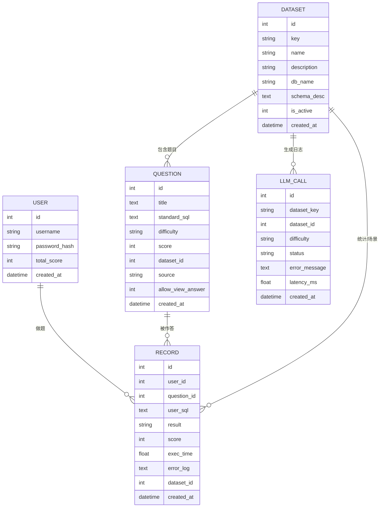
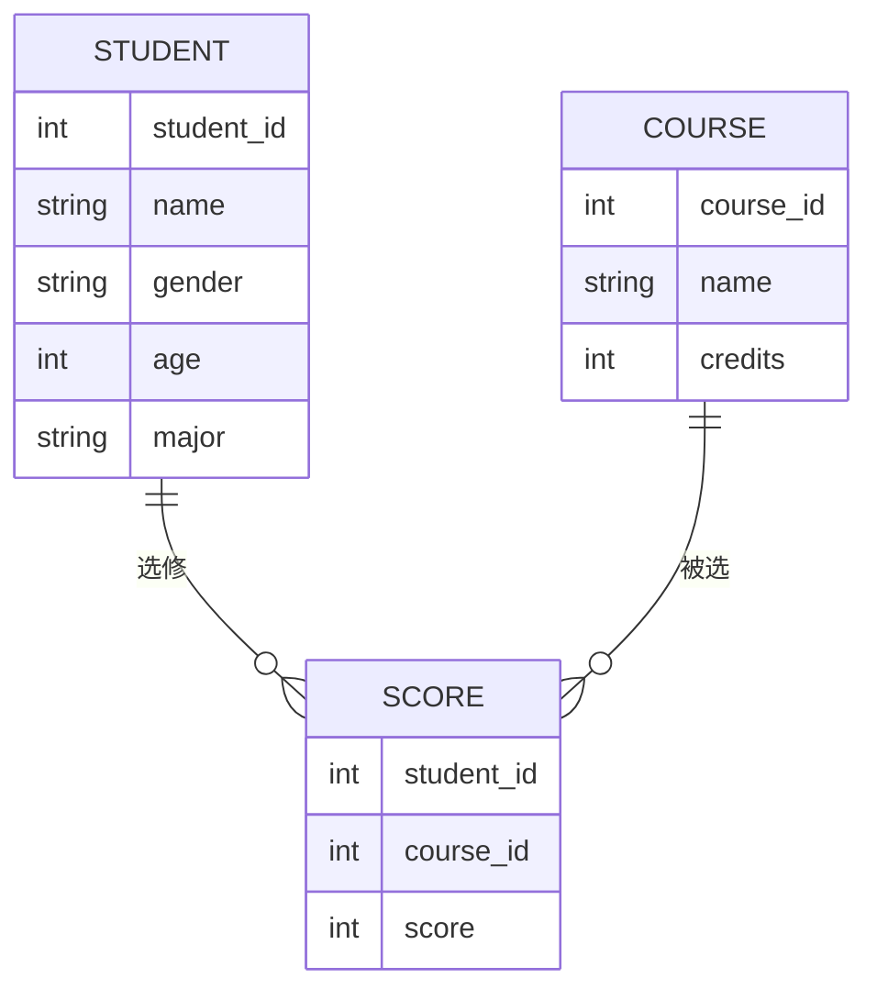

# 数据库设计：ER 图与关系模式说明

## 1. 概念层 ER 图

系统整体分为两类数据库：

- 系统库：`sql_exam_sys` —— 存储用户、题目、做题记录、数据集配置等系统业务数据。
- 多个靶场库：例如 `ds_student_scores`、`ds_ecommerce_orders`、`ds_library_loans` —— 分别存储不同业务场景下的练习数据集，供 SQL 查询练习使用。

### 1.1 系统库（sql_exam_sys）

#### 实体与联系

- **实体：User（用户）**
  - 属性：`id`，`username`，`password_hash`，`total_score`，`created_at`

- **实体：Dataset（数据集/场景配置）**
  - 属性：`id`，`key`，`name`，`description`，`db_name`，`schema_desc`，`is_active`，`created_at`

- **实体：Question（题目）**
  - 属性：`id`，`title`，`standard_sql`，`difficulty`，`score`，`dataset_id`，`source`，`allow_view_answer`，`created_at`

- **实体：Record（做题记录）**
  - 属性：`id`，`user_id`，`question_id`，`user_sql`，`result`，`score`，`exec_time`，`error_log`，`dataset_id`，`created_at`

- **实体：LLMCall（大模型调用日志）**
  - 属性：`id`，`dataset_key`，`dataset_id`，`difficulty`，`status`，`error_message`，`latency_ms`，`created_at`

- **联系：**
  - 一个 `User` 可以有多条 `Record`：`User (1) —— (N) Record`
  - 一个 `Dataset` 可以有多条 `Question`：`Dataset (1) —— (N) Question`
  - 一个 `Question` 可以对应多条 `Record`：`Question (1) —— (N) Record`
  - 一个 `Dataset` 可以有多条 `Record`（冗余字段便于统计）：`Dataset (1) —— (N) Record`
  - 一个 `Dataset` 可以对应多条 `LLMCall`（逻辑关联/日志）：`Dataset (1) —— (N) LLMCall`

#### ER 图（Mermaid 表示）

### 1.2 靶场库示例（学生成绩库 ds_student_scores）

#### 实体与联系

- **实体：Student（学生）**
  - 属性：`student_id`，`name`，`gender`，`age`，`major`

- **实体：Course（课程）**
  - 属性：`course_id`，`name`，`credits`

- **实体：Score（成绩）**
  - 属性：`student_id`，`course_id`，`score`

- **联系：**
  - 一个学生可以选多门课
  - 一门课可以被多个学生选修
  - 通过 `Score` 表表示多对多关系：`Student (1) —— (N) Score (N) —— (1) Course`

#### ER 图（Mermaid 表示）

---

## 2. 关系模式设计

下面用关系模式的形式给出各个表的定义，便于在课程报告和 PPT 中使用。

### 2.1 系统库 `sql_exam_sys`

#### 2.1.1 Users 表

- **关系模式：**  
  `Users(id, username, password_hash, total_score, created_at)`

- **约束条件：**
  - 主键（Primary Key）：`id`
  - 候选键（Candidate Key）：`username` 唯一
  - 业务约束：`total_score` 默认值为 0

#### 2.1.2 Questions 表

- **关系模式：**  
  `Questions(id, title, standard_sql, difficulty, score, dataset_id, source, allow_view_answer, created_at)`

- **约束条件：**
  - 主键：`id`
  - 外键：`dataset_id` → `Datasets(id)`
  - 域约束：`difficulty` ∈ {`Easy`, `Medium`, `Hard`}
  - 业务约束：`score` 常用取值如 {10, 20, 30}
  - 业务约束：`source` 常用取值如 {`db`, `llm`}
  - 业务约束：`allow_view_answer` ∈ {0, 1}

#### 2.1.3 Records 表

- **关系模式：**  
  `Records(id, user_id, question_id, user_sql, result, score, exec_time, error_log, dataset_id, created_at)`

- **约束条件：**
  - 主键：`id`
  - 外键：`user_id` → `Users(id)`
  - 外键：`question_id` → `Questions(id)`
  - 外键：`dataset_id` → `Datasets(id)`（冗余字段便于统计）
  - 域约束：`result` ∈ {`Pass`, `Fail`, `Error`}

#### 2.1.4 Datasets 表

- **关系模式：**  
  `Datasets(id, key, name, description, db_name, schema_desc, created_at, is_active)`

- **约束条件：**
  - 主键：`id`
  - 候选键：`key` 唯一
  - 业务约束：`is_active` ∈ {0, 1}

#### 2.1.5 LLM_Calls 表

- **关系模式：**  
  `LLM_Calls(id, dataset_key, dataset_id, difficulty, status, error_message, latency_ms, created_at)`

- **约束条件：**
  - 主键：`id`
  - 逻辑关联：`dataset_id` → `Datasets(id)`（日志表通常不强制外键约束，避免影响落库）

### 2.2 靶场库示例 `ds_student_scores`

#### 2.2.1 Students 表

- **关系模式：**  
  `Students(student_id, name, gender, age, major)`

- **约束条件：**
  - 主键：`student_id`
  - 域约束：`gender` ∈ {`M`, `F`} 或 `NULL`

#### 2.2.2 Courses 表

- **关系模式：**  
  `Courses(course_id, name, credits)`

- **约束条件：**
  - 主键：`course_id`

#### 2.2.3 Scores 表

- **关系模式：**  
  `Scores(student_id, course_id, score)`

- **约束条件：**
  - 主键：`(student_id, course_id)`（联合主键）
  - 外键：`student_id` → `Students(student_id)`
  - 外键：`course_id` → `Courses(course_id)`

---

## 3. 设计小结（可在答辩时口头说明）

1. 系统库与靶场库分离：
   - `sql_exam_sys` 负责用户、题目、做题记录和数据集配置等核心业务数据。
   - 多个靶场库（如 `ds_student_scores`、`ds_ecommerce_orders`、`ds_library_loans`）只提供查询练习的数据表，结合只读账号，保证 SQL 练习不会破坏系统数据。

2. 多对多关系处理：
   - 学生与课程之间是典型的多对多关系，通过 `Scores(student_id, course_id, score)` 作为连接表来实现，并使用联合主键保证同一学生-课程对只出现一次成绩记录。

3. 做题记录的可追溯性：
   - `Records` 表同时关联 `Users` 和 `Questions`，可以按用户或题目维度统计做题情况，并记录每次提交的结果、得分和错误日志，便于追踪和分析。

---

## 4. 多业务场景与数据集（Dataset）扩展设计

为满足“将来可能面向多种业务场景”的产品级需求，在当前“1 个系统库 + 多个靶场库”的结构基础上，在系统库中增加一层 **数据集（Dataset）抽象**。核心思路如下：

1. 新增 `datasets` 表（位于 `sql_exam_sys`）：
   - 关系模式：
     `Datasets(id, key, name, description, db_name, schema_desc, created_at, is_active)`
   - 含义：
     - `key`：数据集英文 key，例如 `student_scores`、`ecommerce_orders`。
     - `name`：中文名称，例如“学生成绩场景”、“电商订单场景”。
     - `db_name`：该数据集实际所在的数据库名，例如 `ds_student_scores`、`ds_ecommerce_orders`、`ds_library_loans`。
     - `schema_desc`：可选字段，用于存储该数据集下表结构或示例 JSON，供 LLM 出题使用。

2. 在 `Questions` 表中引入外键 `dataset_id`：
   - 扩展后的关系模式：
     `Questions(id, title, standard_sql, difficulty, score, created_at, dataset_id, source, allow_view_answer)`
   - 约束：
     - 外键：`dataset_id` → `Datasets(id)`。
   - 作用：
     - 每道题都明确关联到某一业务场景的数据集，LLM 出题与判题时可以基于不同 Schema 生成题目。

3. 在 `Records` 表中采用方式 B：增加冗余字段 `dataset_id`：
   - 扩展后的关系模式：
     `Records(id, user_id, question_id, user_sql, result, score, exec_time, error_log, created_at, dataset_id)`
   - 约束：
     - 外键：`dataset_id` → `Datasets(id)`。
   - 原因：
     - 虽然可以通过 `Records.question_id → Questions.dataset_id` 间接获取数据集信息，但在高并发、大数据量的统计查询场景下，直接在 `Records` 上按 `dataset_id` 过滤和聚合会更加高效，属于“以少量冗余换取查询性能”的折中设计。

5. 增加 `llm_calls` 表记录大模型调用日志：
   - 关系模式：
     `LLM_Calls(id, dataset_key, dataset_id, difficulty, status, error_message, latency_ms, created_at)`
   - 作用：
     - 记录 LLM 出题/讲解过程的成功失败、耗时和错误信息，便于排错与统计。

4. 数据集与物理库/表的关系：
   - 当前版本：每个数据集对应一个独立的靶场库，例如：
     - `student_scores` → `ds_student_scores` 库中的 `students/courses/scores` 表；
     - `ecommerce_orders` → `ds_ecommerce_orders` 库中的 `ec_customers/ec_orders/ec_order_items/ec_products` 表；
     - `library_loans` → `ds_library_loans` 库中的 `lib_readers/lib_books/lib_loans` 表。
   - 后续若数据量或业务场景继续扩展，只需在 `datasets` 中新增一条记录并设计对应的靶场库 Schema，即可无侵入地接入新的数据集。

通过上述扩展设计，当前课设版本仍可只启用一个默认数据集，但系统在架构层面已经预留了面向多业务场景演进的能力，更符合真实产品在可扩展性方面的要求。
