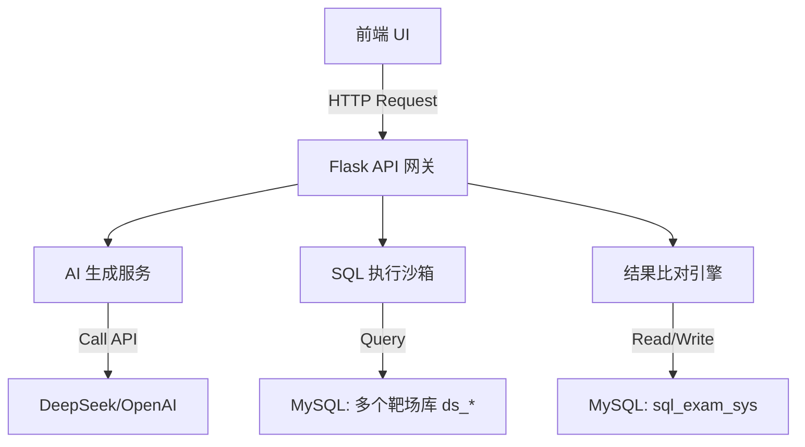

# 软件系统设计说明书

## 项目名称：基于大语言模型的智能 SQL 判题系统 (AutoSQL-Judge)

**版本号**：V1.4.0
**文档状态**：正式发布
**编写日期**：2025-12-08

------

## 2. 需求分析 (Requirement Analysis)

### 2.1 用户角色 (User Roles)

- **普通用户 (Student/Candidate)**：注册登录、进行题目练习、查看表结构、提交答案、查看积分与排名.
- **教师 / 助教 (Teacher/TA)**：布置练习或实验（选题、设定难度与时间范围）、查看班级与个人完成情况、分析错题分布，为教学过程评估提供依据.
- **管理员 (System Admin)**：维护后台数据库与靶场数据集、配置或切换 AI 模型提供方、查看系统运行日志与调用情况.

### 2.2 功能性需求 (Functional Requirements)

#### 2.2.1 题目生成模块

- **FR-01**: 系统应能读取指定靶场数据库（如 ds_student_scores / ds_ecommerce_orders / ds_library_loans）的元数据（表名、字段名、类型）。
- **FR-02**: 系统需集成 LLM API，发送 Schema 和 Prompt，接收 JSON 格式的题目（含描述、标准答案、难度）。
- **FR-03**: 支持将生成的题目缓存至数据库，避免重复消耗 Token.

#### 2.2.2 答题与执行模块

- **FR-04**: 前端提供代码编辑器，支持 SQL 语法高亮.
- **FR-05**: 前端需以树状图或表格形式展示当前练习涉及的数据库表结构.
- **FR-06**: 用户提交 SQL 后，后端需在**只读权限**下执行用户代码.

#### 2.2.3 判题模块 (核心)

- **FR-07**: 系统需分别执行"标准答案"与"用户答案".
- **FR-08**: 系统需对比两个执行结果集（DataFrame）的内容.规则：忽略行顺序（Sort），对比列名及数据值.
- **FR-09**: 判题结果需包含：状态（AC/WA/Error）、执行耗时、错误信息（如有）。

#### 2.2.4 用户与计分模块

- **FR-10**: 系统需支持用户注册与登录功能，密码需加密存储.
- **FR-11**: 系统需记录用户每次提交的得分，并累计总分.
- **FR-12**: 系统需提供积分排行榜功能，展示用户排名.

#### 2.2.5 后台管理与监控模块

- **FR-13**: 系统应提供教师/管理员后台界面，可按数据集、难度、题目来源（题库/LLM）查看题目列表及详情（含标准 SQL）。
- **FR-14**: 后台可查看提交记录列表，并按用户、题目、结果（Pass/Fail/Error）及时间范围进行筛选，用于教学统计与Debug.
- **FR-15**: 系统需记录大模型调用日志（调用方、模型名、数据集、耗时、状态、错误信息），以便排查超时、限流等线上问题.
- **FR-16**: 后台应提供基础统计视图，例如：按题目维度的错误率、按用户维度的总分与通过题数、最近一段时间的 LLM 调用成功率.
- **FR-17**: 提供系统健康状态面板，汇总 `/health` 状态、数据库连通性、自最近一段时间起的判题 Error 数量等关键指标.

### 2.3 非功能性需求 (Non-Functional Requirements)

- **NFR-01 安全性**：严禁用户执行 DROP, DELETE, UPDATE, INSERT, TRUNCATE 等修改性操作.
- **NFR-02 响应速度**：判题接口响应时间应 < 2秒（不含 AI 生成时间）。
- **NFR-03 易用性**：界面简洁，报错信息需人性化（例如提示"语法错误"而非直接抛出 Traceback）。

------

## 3. 系统设计 (System Design)

### 3.1 总体架构 (Architecture)

采用经典的 **B/S (Browser/Server)** 架构，前后端分离设计.

- **表现层 (Frontend)**: HTML5 + Vue.js + Bootstrap.负责页面交互与数据渲染.
- **业务逻辑层 (Backend)**: Python Flask.负责 RESTful API 接口、AI 调用、判题逻辑.
- **数据持久层 (Database)**: MySQL.负责存储题目、用户数据及业务数据.

### 3.2 模块划分



### 3.3 技术选型与权衡

- **后端与数据层技术栈**：
  - 后端选用 Python + Flask，便于快速实现 RESTful API，并且与大模型生态（各类 Python SDK）兼容性最好；
  - 数据访问层采用 SQLAlchemy 统一管理数据库连接和方言，既可以写原生 SQL，又方便后续演进为 ORM 模式；
  - 判题核心使用 Pandas，将 SQL 执行结果加载为 DataFrame，进行统一排序与严格相等性比较，实现“结果集级别”的语义判题.
- **为什么使用 Pandas 来做判题？**
  - SQL 是声明式语言，同一逻辑往往有多种写法（不同 JOIN 写法、子查询/CTE 等），单纯比较 SQL 字符串无法反映真实正确性；
  - 本系统通过将标准答案 SQL 与用户 SQL 的结果集分别读入 DataFrame，忽略行顺序后进行逐列逐行比对，只有在数据完全一致时才认为通过；
  - 这种方式非常适合当前“教学/求职练习平台 + 小到中等规模数据集”的场景，易于实现和调试.
- **Pandas 判题的边界与演进方向**：
  - 在大规模结果集、高并发环境下，频繁将数据拉回应用层用 Pandas 处理会带来明显的内存与网络开销；
  - 未来可以将 `judge_sql` 抽象为独立判题服务，内部替换为：
    - 使用数据库自身的差集/EXCEPT 运算：`(标准SQL EXCEPT 用户SQL) UNION (用户SQL EXCEPT 标准SQL)` 是否为空；
    - 或者将结果写入临时表，再通过 SQL 做集合对比，从而将计算下推到数据库层，提升可扩展性.

#### 3.3.1 与通用开源 OJ 的差异

- **当前系统定位**：
  - 本项目是一个“面向 SQL 的专项判题引擎原型”，强调多业务场景靶场设计及结果集级判题逻辑；
  - 不以“通用 OJ 平台”自居，暂未实现大规模并发调度、容器沙箱隔离、多语言编译运行等能力.
- **与典型开源 OJ 的对比**：
  - 开源 OJ（如若干基于 PHP/Java/Go 的评测系统）通常提供完整的题库管理、评测队列、沙箱执行环境和监控告警；
  - 本系统更多聚焦在：
    - 如何用 `sql_exam_sys + ds_*` 多库结构管理练习场景；
    - 如何定义和实现一套可复用的 SQL 判题接口（以 Pandas 为初版实现）。

#### 3.3.2 未来基于开源 OJ + 大模型的演进方案

- **判题引擎插件化**：
  - 将当前 `utils/sql_judge.py` 中的判题逻辑抽象为一个“SQL 判题服务”，对外只暴露统一 HTTP/gRPC 接口；
  - 在开源 OJ 的自定义题型/判题脚本扩展点上，接入该 SQL 判题服务，使其成为 OJ 的一个“SQL 题型插件”.
- **与大模型能力的结合**：
  - 单独部署一个 LLM 服务模块，提供“自动出题、生成解析、智能提示”等接口；
  - OJ 平台在创建/更新题目时调用 LLM 接口，生成题干和标准 SQL，并回写到自身的题库；
  - 在用户提交错误 SQL 时，调用 LLM 生成针对性的错误分析和改进建议，提升练习体验.
- **架构演进思路**：
  - 当前课设版本作为单机原型，验证多靶场数据集设计与 SQL 结果集判题的可行性；
  - 未来可在保持 `datasets + questions + records` 这一套数据模型不变的前提下：
    - 拆分判题服务为独立微服务，引入消息队列实现异步评测；
    - 复用成熟开源 OJ 的用户系统、队列调度和沙箱执行能力，将本系统演进为“基于 OJ 的 SQL + 大模型智能练习平台”。

### 3.4 管理端（教师/管理员端）设计

- **当前实现的管理端能力**：
  - 提供 `/admin` 页面，使用与学生端一致的苹果风样式，展示最近若干条题目与提交记录的概览；
  - 题目列表基于 `questions + datasets` 联表查询，展示题目 ID、标题、难度、分值、所属数据集、创建时间；
  - 提交记录列表基于 `records` 表，展示用户 ID、题目 ID、结果（Pass/Fail/Error）、得分、执行耗时与提交时间，便于教师快速了解整体完成情况与故障情况.
- **面向真实教学场景的演进方向**：
  - 在后台增加筛选和搜索能力：按数据集、难度、题目来源（题库/LLM）、时间范围等过滤题目与记录；
  - 引入“实验单 / 作业（Assignment）”抽象，支持教师以题组形式布置实验，并查看班级与个人的完成度和平均得分；
  - 在后台增加学生视图：汇总每个学生/账号的总分、通过题数、最近活跃时间，并支持导出为 CSV 供教务系统使用；
  - 联合大模型调用日志（`llm_calls` 等表）构建简单运维面板：展示 LLM 调用量、平均耗时、超时/429 等异常分布，为控制调用成本与排故提供依据.

------

## 4. 数据库设计 (Database Design)

系统采用"1 个系统库 + 多个靶场库"的隔离策略，兼顾安全性与扩展性.

### 4.1 概念模型设计 (E-R 图描述)

- **实体：用户 (User)**
  - 属性：ID、用户名、密码哈希、总积分、创建时间.
- **实体：题目 (Question)**
  - 属性：ID、题目描述、标准SQL、难度、分值、创建时间.
- **实体：提交记录 (Submission)**
  - 属性：ID、用户ID、题目ID、用户SQL、判题结果、得分、错误日志、耗时.
- **关系**：
  - 一个用户对应多条提交记录 (1:N)
  - 一个题目对应多条提交记录 (1:N)

### 4.2 物理表结构设计

#### 4.2.1 系统管理库 (sql_exam_sys)

| 表名          | 字段名        | 类型         | 说明                          |
| ------------- | ------------- | ------------ | ----------------------------- |
| **users**     | id            | INT (PK)     | 用户唯一标识                  |
|               | username      | VARCHAR(50)  | 用户名（唯一）                |
|               | password_hash | VARCHAR(255) | 密码哈希值                    |
|               | total_score   | INT          | 累计总积分                    |
|               | created_at    | DATETIME     | 注册时间                      |
| **questions** | id            | INT (PK)     | 题目唯一标识                  |
|               | title         | TEXT         | 自然语言题目描述              |
|               | standard_sql  | TEXT         | AI生成的标准答案              |
|               | difficulty    | VARCHAR(10)  | 难度（Easy/Medium/Hard）      |
|               | score         | INT          | 题目分值（10/20/30）          |
|               | created_at    | DATETIME     | 创建时间                      |
| **records**   | id            | INT (PK)     | 记录ID                        |
|               | user_id       | INT (FK)     | 关联用户ID                    |
|               | question_id   | INT (FK)     | 关联题目ID                    |
|               | user_sql      | TEXT         | 用户提交的代码                |
|               | result        | VARCHAR(10)  | Pass / Fail / Error           |
|               | score         | INT          | 本次得分（正确得分，错误为0） |
|               | exec_time     | FLOAT        | 执行耗时(秒)                  |
|               | error_log     | TEXT         | 错误信息（如有）              |
|               | created_at    | DATETIME     | 提交时间                      |

#### 4.2.2 练习靶场库集 (ds_student_scores / ds_ecommerce_orders / ds_library_loans)

示例：
- `ds_student_scores`：包含 students、courses、scores 等表，用于学生成绩场景.
- `ds_ecommerce_orders`：包含 customers、orders、order_items、products 等表，用于电商订单场景.
- `ds_library_loans`：包含 readers、books、loans 等表，用于图书借阅场景.

上述靶场库均为只读执行环境，用于实际运行标准 SQL 与用户 SQL 进行结果集比对.

### 4.3 多业务场景靶场扩展设计（Datasets）

当前版本内置了多套业务场景（学生成绩、电商订单、图书借阅等）作为练习靶场数据.为统一管理这些多库靶场，在数据库层面采用如下设计：

- 在系统库 `sql_exam_sys` 中新增 `datasets` 表，用于抽象不同业务场景的数据集：
  - 字段示意：`id, key, name, description, db_name, schema_desc, created_at, is_active`.
  - 示例：`id = 1, key = 'student_scores', db_name = 'ds_student_scores'` 表示学生成绩场景；`id = 2, key = 'ecommerce_orders', db_name = 'ds_ecommerce_orders'` 表示电商订单场景.
- 在 `questions` 表中增加外键字段 `dataset_id`，指向 `datasets(id)`：
  - 每道题明确属于某个数据集（业务场景），LLM 出题时可根据所选数据集的 Schema 生成不同领域的 SQL 练习题.
- 在 `records` 表中采用方式 B：增加冗余字段 `dataset_id`：
  - 虽可通过 `question_id` 间接获取数据集信息，但在统计分析时直接按 `dataset_id` 过滤与聚合更高效，更符合高并发场景下的产品级设计需求.

通过引入 `datasets` 抽象层，并结合多靶场库 `ds_*` 的物理划分，系统从“一套固定学生成绩表”演进为“支持多种可配置业务场景的数据集管理平台”，更加贴近真实线上产品的扩展性需求.

------

## 5. 接口设计 (API Specification)

### 5.1 获取题目接口

**URL**: /api/question/generate

**Method**: GET

**Response**：

```json
{
    "status": "success",
    "data": {
        "id": 101,
        "title": "查询所有计算机系学生的姓名和年龄",
        "difficulty": "Easy",
        "score": 10,
        "tables": ["students"]
    }
}
```

### 5.2 提交判题接口

**URL**: /api/judge/submit

**Method**: POST

**Body**：

```json
{
    "question_id": 101,
    "user_sql": "SELECT name, age FROM students WHERE major='计算机'"
}
```

**Response**：

```json
{
    "status": "success",
    "data": {
        "result": "Pass",
        "msg": "恭喜！答案正确",
        "score": 10,
        "execution_time": 0.045
    }
}
```

------

## 6. 安全设计 (Security Design)

为了防止 SQL 注入删除库表，采取**双重防御机制**：

### 6.1 代码层正则拦截 (Regex Filter)

在后端接收到 user_sql 后，立即进行正则匹配.若包含以下关键词（忽略大小写），直接驳回：

```
DROP, TRUNCATE, DELETE, UPDATE, INSERT, ALTER, GRANT, REVOKE
```

### 6.2 数据库权限隔离 (Privilege Separation)

- 后端连接 `sql_exam_sys` 使用 admin 账号（用于写入做题记录）。
- 后端连接各个靶场库（如 `ds_student_scores`）执行用户查询时，**强制使用只读账号**（需在 MySQL 中创建 `readonly_user`，仅授予 SELECT 权限）。

### 6.3 用户密码安全

- 使用 `werkzeug.security` 的 `generate_password_hash` 和 `check_password_hash` 进行密码加密与验证.
- 禁止明文存储密码.

------

## 7. 测试计划 (Test Plan)

### 7.1 单元测试

- **AI 接口测试**：验证是否能稳定返回 JSON 格式.
- **数据库连接测试**：验证 Flask 能否同时连接两个数据库.
- **用户认证测试**：验证注册、登录、密码加密功能正常.

### 7.2 集成测试

- **场景 A (正确)**：用户输入与标准答案逻辑一致的 SQL -> 预期返回 Pass，积分增加.
- **场景 B (错误)**：用户输入逻辑错误的 SQL -> 预期返回 Fail，积分不变.
- **场景 C (恶意)**：用户输入 `DROP TABLE students` -> 预期返回 Warning 拦截信息.
- **场景 D (登录)**：用户输入正确密码 -> 登录成功；错误密码 -> 登录失败.

------

## 8. 项目管理 (Project Management)

### 8.1 开发进度表 (Gantt Chart Timeline)

| 阶段 | 时间 | 任务内容 |
|------|------|----------|
| Phase 1 | Day 1-2 | 环境配置、数据库建表（含用户表）、GitHub 仓库初始化 |
| Phase 2 | Day 3-4 | 后端核心开发（用户认证、AI 接入、Pandas 判题逻辑） |
| Phase 3 | Day 5-7 | 前端页面开发（登录注册、答题界面、排行榜）、接口联调 |
| Phase 4 | Day 8-9 | 安全性增强、Bug 修复、UI 美化 |
| Phase 5 | Day 10 | 撰写实验报告、录制演示视频、最终提交 |

### 8.2 版本控制策略

使用 **Git** 进行版本控制.

- **Main 分支**: 存放稳定可演示的代码.
- **Dev 分支**: 开发新功能，测试通过后合并入 Main.

**提交规范**：
- `feat: 增加xx功能`
- `fix: 修复xx问题`
- `docs: 更新文档`  

------

### 💡 附录：面试亮点话术 (Developer Notes)

（写在文档最后，提醒自己）

**Q1: 为什么用 Pandas 判题？**

答：因为 SQL 是声明式语言，实现同一逻辑的写法很多（比如 JOIN vs WHERE）。如果用字符串匹配（String Match）太死板。将 SQL 执行结果转化为 DataFrame 进行**语义级比对**，才是最科学的.

**Q2: 如何保证 AI 输出稳定？**

答：在 Prompt 中使用了 System Role 强化约束，并强制要求返回 JSON 格式，便于程序解析。同时在后端做了 try-catch 容错处理.

**Q3: 为什么要做用户登录和积分系统？**

答：登录系统可以追踪用户学习进度，积分机制能激励用户持续练习。同时也是完整 Web 应用的标配功能，体现全栈开发能力.

**Q4: 密码为什么要哈希存储？**

答：明文存储一旦数据库泄露，所有用户密码暴露。哈希是单向加密，即使数据库被盗，攻击者也无法反推出原始密码.

------

## 9. 文档版本与变更记录

| 版本号  | 日期        | 变更说明                                                     |
|---------|-------------|--------------------------------------------------------------|
| V1.0.0 | 2025-12-08 | 初始版本，定义双库结构、核心功能需求与接口设计.           |
| V1.1.0 | 2025-12-08 | 新增多业务场景靶场 `datasets` 抽象设计，并在 questions/records 中预留 `dataset_id` 字段. |
| V1.2.0 | 2025-12-08 | 将靶场从单库 sql_playground 调整为多库方案（ds_student_scores / ds_ecommerce_orders / ds_library_loans），并在文档中统一说明. |
| V1.3.0 | 2025-12-09 | 补充 Pandas 判题技术选型说明，并新增“与开源 OJ 的对比及未来演进（含大模型）”章节. |
| V1.4.0 | 2025-12-11 | 补充更细化的角色划分与后台管理/监控需求，新增管理端（教师/管理员端）设计章节，并记录当前已实现的 `/admin` 简易后台能力. |

## 10. 与开源 OJ 的对比及未来演进（含大模型）

### 10.1 对标的开源 OJ：QDUOJ 概览

- **QDUOJ（青岛大学 Online Judge）** 是一个流行的开源 OJ 平台，其整体架构分层清晰：
  - **Backend（Django）**：负责题库、比赛、用户权限、提交记录等业务逻辑.
  - **Frontend（Vue）**：提供比赛、题目列表、提交记录等前端页面.
  - **JudgeServer（Go）**：对外提供 HTTP 判题 API，是后台调用的评测网关.
  - **Judger（C + seccomp）**：在受控沙箱中真正执行用户代码，限制系统调用和资源占用.
  - **Backend（Django）**：负责题库、比赛、用户权限、提交记录等业务逻辑。
  - **Frontend（Vue）**：提供比赛、题目列表、提交记录等前端页面。
  - **JudgeServer（Go）**：对外提供 HTTP 判题 API，是后台调用的评测网关。
  - **Judger（C + seccomp）**：在受控沙箱中真正执行用户代码，限制系统调用和资源占用。
- **典型评测流程**：
  1. 用户在前端页面提交代码；
  2. Backend 将提交入库，并调用 JudgeServer 提供的判题 HTTP 接口；
  3. JudgeServer 调用本地 Judger，在容器/沙箱中编译和运行代码；
  4. Judger 返回运行结果与资源使用情况，JudgeServer 将结果回传 Backend，更新提交记录。
- **常见扩展点示例**：
  - 在 QDUOJ 的 `languages.py` 中为不同语言配置 `compile_command` 和 `command`，可新增/调整编译运行方式；
  - 修改 JudgeServer 的 Docker 镜像，为评测环境增加新的运行时（如新版 Node.js、特定数据库客户端等）；
  - 在 Backend 中扩展题目类型或评测逻辑分支，为特殊题型（如交互题、特殊判题）提供定制流程。

### 10.2 AutoSQL-Judge 在其中扮演的角色

- **定位为 QDUOJ 的 SQL 专项判题插件**：
  - 保留 QDUOJ 现有的用户系统、题库、比赛和评测队列能力；
  - 对于“SQL 类型题目”，Backend 不再将提交代码发送到通用 JudgeServer，而是调用 AutoSQL-Judge 提供的 SQL 判题 API；
  - AutoSQL-Judge 内部复用本课设设计的：`sql_exam_sys + ds_*` 多库结构、`datasets + questions + records` 数据模型以及结果集级判题逻辑。
- **与当前技术栈的关系**：
  - AutoSQL-Judge 继续使用 Python + Flask + SQLAlchemy + Pandas（或后续演进为数据库差集判题）实现 SQL 专项评测；
  - 在整体架构中，它更像是一个“外接判题微服务”，专门承担 SQL 场景和与大模型交互的工作。

### 10.3 集成 SQL + 大模型的高层方案图（文字描述）

```text
[浏览器 / QDUOJ 前端 (Vue)]
                |
                v
[QDUOJ Backend (Django)]
       |             \
(普通题型 -> JudgeServer) \
                         \
                      (SQL 题型)
                         |
                         v
           [AutoSQL-Judge API 网关 (Flask)]
                  |                 \
                  v                  v
        [SQL 判题服务]        [LLM 服务模块]
           |                       |
    [多靶场 MySQL ds_*]     [LLM 提供方 (如 DeepSeek)]
```

- **整体流程说明**：
  1. 用户在 QDUOJ 上选择 SQL 类型题目并提交 SQL；
  2. QDUOJ Backend 识别题型为 SQL，调用 AutoSQL-Judge 的 `/api/judge/by_question` 等判题接口；
  3. AutoSQL-Judge 根据 `question_id` 和 `dataset_id` 选择对应靶场库，在只读账号下分别执行标准 SQL 与用户 SQL，并进行结果集级判题；
  4. 如需生成解析/提示，AutoSQL-Judge 调用独立的 LLM 服务模块，生成针对本次提交的自然语言讲解或改进建议；
  5. 判题结果与可选解析通过 API 返回给 QDUOJ Backend，写入其自身的提交记录表，前端统一展示。

### 10.4 对本课设的意义

- 当前 AutoSQL-Judge 课设实现的是一个**单机原型**：
  - 证明了多业务场景靶场设计（`datasets + ds_*`）的可行性；
  - 验证了基于结果集对比的 SQL 判题方案在小到中等规模数据集上的可用性。
- 通过与 QDUOJ 的对比与集成构想，体现出：
  - 对真实在线评测平台（用户/题库/评测队列/沙箱）的基本架构认知；
  - 清楚知道如何将“SQL 判题 + 大模型出题与讲解”封装成一个可插拔的判题服务，接入成熟 OJ 平台；
  - 为后续从课程项目演进到产品级平台预留了清晰的技术路线，在测试开发/教学评测类岗位面试中具备亮点价值。